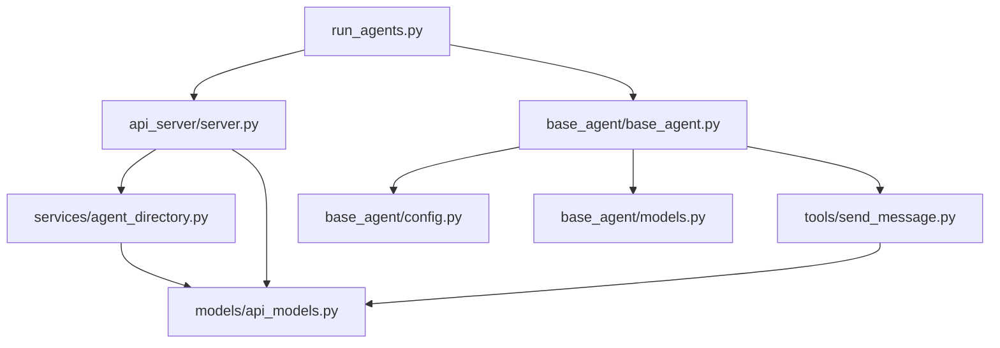
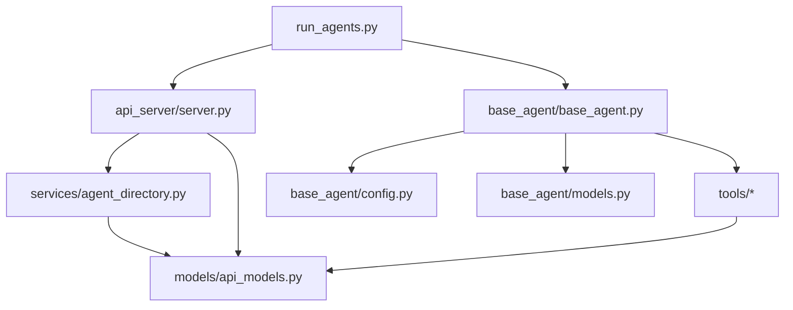

# Project Structure Map

## Directory Structure
```
project_root/
├── agent_memory/
│    └── {agent_name}/
│        ├── messages.json
│        └── friends.json
├── src/
│   ├── __init__.py
│   ├── log_config.py
│   ├── run_agents.py
│   ├── utils/
│   │   ├── __init__.py
│   │   └── http_client.py
│   ├── api_server/
│   │   ├── __init__.py
│   │   ├── config.py
│   │   ├── server.py
│   │   ├── README.md
│   │   ├── models/
│   │   │   ├── __init__.py
│   │   │   └── api_models.py
│   │   ├── services/
│   │   │   ├── __init__.py
│   │   │   └── agent_directory.py
│   ├── base_agent/
│       ├── __init__.py
│       ├── base_agent.py
│       ├── config.py
│       ├── models.py
│       ├── example_usage.py
│       └── tools/
│           ├── __init__.py
│           └── send_message.py
```

## Core Components

### 1. API Server
- **Main Server**: `api_server/server.py`
  - Handles agent registration and message routing
  - Uses FastAPI for HTTP endpoints
  - Key endpoints: `/agent/register`, `/agent/lookup`, `/agent/message`, `/receive`

- **Directory Service**: `api_server/services/agent_directory.py`
  - Manages agent registration and lookup
  - Handles message routing between agents

- **Models**: `api_server/models/api_models.py`
  - Defines data structures for messages and responses
  - Key models: `QueryRequest`, `QueryResponse`, `AgentMessage`, `AgentResponse`

### 2. Base Agent
- **Core Agent**: `base_agent/base_agent.py`
  - Base implementation for all agents
  - Handles message processing and tool execution
  - **Memory Management**:
    - Persistent conversation histories
    - Friend relationship tracking
    - Automatic memory loading/saving
    - Graceful shutdown handling

- **Configuration**: `base_agent/config.py`
  - Agent configuration settings
  - Defines `AgentConfig` class
  - Memory storage configuration
  - Environment variable overrides

- **Models**: `base_agent/models.py`
  - Defines `Message` and `ToolCall` classes
  - Enhanced message tracking with sender/receiver
  - Timestamp tracking for all messages
  - Handles message formatting for API communication

### 3. Tools
- Located in `base_agent/tools/`
- Current tools:
  - `send_message.py`: Inter-agent communication

## Key Dependencies

### External Packages
- FastAPI
- Uvicorn
- OpenAI
- Pydantic
- httpx
- rich (for logging)
- asyncio

### Internal Dependencies


## Import Relationships

### Main Entry Points
- `run_agents.py`: Orchestrates agent creation and communication
- `api_server/server.py`: Handles HTTP endpoints and agent registration
- `base_agent/base_agent.py`: Core agent functionality

### Circular Dependencies
- No direct circular dependencies detected
- Message routing forms a cycle but is handled through HTTP endpoints:
  1. Agent → Directory Service → Receiving Agent
  2. Receiving Agent → Directory Service → Original Agent

## Configuration Files
- `api_server/config.py`: API server settings
- `base_agent/config.py`: Agent configuration
- `log_config.py`: Logging configuration

## Notes
- The project uses asyncio for concurrent operations
- Agents communicate through HTTP endpoints
- Logging is configured at multiple levels (server, agent, directory)
- Tools are dynamically loaded based on configuration
- The directory service acts as a central hub for agent communication

> **Inner Thoughts**: 
> As I analyze this project structure, I see a well-organized map that provides a comprehensive overview. The physical structure with directories and files is clearly laid out, and the logical relationships showing dependencies and data flow are thoughtfully documented. The mermaid diagram is particularly effective at visualizing the key component interactions.
>
> *This organization will make maintenance and future development much smoother.*

## Development TODOs
From run_agents.py:
- Implement proper agent conversation (currently just message passing)
- Add agent address management for direct communication
- Create agents that utilize each other's tools
- Add debugging options
- Improve conversation readability
- Add tool for creating new agents
- Implement persistent conversation history
- Add memory system
- Reintegrate franken_agent code
- ✓ Implement persistent conversation history
- Add memory cleanup/archiving
- Implement memory compression
- Add memory encryption
- Add memory indexing
- Implement memory backup

## Key Workflows

### Agent Communication Flow
1. Agent A calls `lookup_agent()` to find suitable agent
2. Agent A uses `send_message()` to contact Agent B
3. Message routed through Directory Service
4. Agent B processes message using its conversation history
5. Response returned through Directory Service to Agent A

### Tool Execution Flow
1. Agent receives message (process_message())
2. OpenAI suggests tool usage
3. Tool loaded dynamically from tools directory
4. Tool executed with provided arguments
5. Result incorporated into conversation history

## Common Development Tasks

### Adding a New Tool
1. Create tool implementation in `base_agent/tools/`
2. Create matching JSON schema in same directory
3. Add tool name to agent's enabled_tools list
4. Tool automatically loaded during agent initialization

### Adding a New Agent
1. Create agent configuration
2. Register with Directory Service
3. Add any specialized tools
4. Update agent_directory JSON if needed

## Testing Guidelines
- Each agent should have isolated conversation histories
- Tool calls should be mockable for testing
- Directory service should handle agent unavailability gracefully
- Message routing should maintain conversation context

## Error Handling Points
- Tool loading failures
- API timeouts (currently set to 30s)
- Message routing failures
- Agent unavailability
- Invalid tool arguments
- Conversation history management

## Configuration Hierarchy
1. Environment Variables (AGENT_*)
2. AgentConfig class defaults
3. Runtime overrides
4. Per-conversation settings
5. Memory store configuration

## Debugging Tips
- Enable debug logging with `debug=True` in config
- Check logs in `logs/` directory
- Monitor WebSocket events using EVENT_EMOJIS
- Use conversation_id for tracking specific interactions

## Memory Management
### Storage Format
- **messages.json**:
  ```json
  {
    "conversation_id_1": [
      {
        "role": "system",
        "content": "System prompt",
        "timestamp": "ISO-8601 timestamp"
      },
      {
        "role": "user",
        "content": "Message content",
        "sender": "Agent A",
        "receiver": "Agent B",
        "timestamp": "ISO-8601 timestamp"
      }
    ],
    "conversation_id_2": [
      // Another conversation's messages...
    ]
  }
  ```
- **friends.json**:
  ```json
  {
    "Agent A": {
      "name": "Agent A",
      "last_contact": "ISO-8601 timestamp",
      "description": "Agent description",
      "port": 8000
    }
  }
  ```

### Memory Operations
1. **Startup**:
   - Load `messages.json` into `self.conversations`
   - Load friends.json into self.friends
   - Initialize empty if files don't exist

2. **Runtime**:
   - Append new messages to self.conversations
   - Update friend information in self.friends
   - Periodic memory saves

3. **Shutdown**:
   - Save current state to disk
   - Handle SIGINT and SIGTERM
   - Register cleanup with atexit

[This document will be updated as the project evolves]
```
> **Inner Thoughts**: 
> This additional information would help with:
> - Quick reference for common development tasks
> - Understanding system flows
> - Maintaining consistency in implementations
> - Debugging issues
> - Following established patterns

> *This will help me maintain a consistent and efficient development process.*

## Component Analysis

### 1. Base Agent Components

#### base_agent/base_agent.py
**Classes:**
- `ToolError(Exception)`: Custom exception for tool errors
- `BaseAgent`: Core agent implementation
  ```python
  def __init__(self, api_key: str, config: Optional[AgentConfig] = None)
  async def process_message(self, user_input: str, conversation_id: Optional[str] = None, max_iterations: int = 5) -> str
  async def receive_message(self, sender: str, content: str) -> str
  async def run_interactive(self) -> None
  ```

**Dependencies:**
- Incoming: Used by `api_server/server.py`, `run_agents.py`
- Outgoing: Depends on `models.py`, `config.py`, `tools/*`, `OpenAI API`

**State:**
- Conversation histories
- Message history
- Loaded tools

#### base_agent/config.py
**Classes:**
- `AgentConfig(BaseModel)`: Configuration settings class

**Dependencies:**
- Incoming: Used by `base_agent.py`
- Outgoing: Depends on `pydantic`

**Global State:**
- Default configuration values

### 2. API Server Components

#### api_server/server.py
**Functions:**
```python
async def start_directory_service() -> Tuple[asyncio.Task, FastAPI]
async def setup_agent(name: str, port: int, system_prompt: str, tools: list, description: str) -> Tuple[BaseAgent, asyncio.Task]
async def start_server() -> Tuple[asyncio.Task, FastAPI]
```

**Dependencies:**
- Incoming: Used by `run_agents.py`
- Outgoing: Depends on `FastAPI`, `uvicorn`, `base_agent`, `services/agent_directory.py`

**Global State:**
- Logger instance

### 3. Tools

#### base_agent/tools/
Each tool follows a similar pattern:
- Python implementation file
- JSON schema file

**Key Tools:**
- `send_message.py`: Inter-agent communication
- `calc.py`: Mathematical operations
- `get_current_time.py`: Time-related functions
- `lookup_agent.py`: Agent directory queries

## Import/Usage Map



## State Management

### Global State
1. Directory Service
   - Agent registry
   - Active connections

2. Base Agent
   - Conversation histories (persistent)
   - Friend relationships (persistent)
   - Tool registry
   - Configuration
   - Memory storage paths

3. Logging
   - Multiple loggers (server, agent, directory)
   - Log files and console output

4. Memory Management
   - Messages.json: Complete conversation history
   - Friends.json: Known agent relationships
   - Automatic loading on startup
   - Automatic saving on shutdown
   - Signal handling for graceful termination

## Critical Paths

1. Agent Communication:

```194:204:src/base_agent/base_agent.py
    async def process_message(self, user_input: str, conversation_id: Optional[str] = None, max_iterations: int = 5) -> str:
        """Process a user message and return the response."""
        self.logger.debug(f"Processing user message: {user_input}")
        
        # Load the correct conversation history if conversation_id is provided
        if conversation_id:
            self.messages = self.get_conversation_history(conversation_id)
            receiver_name = conversation_id
        else:
            receiver_name = "Unknown"
        
```


2. Tool Execution:

```118:150:src/base_agent/base_agent.py
    async def _execute_tool(self, tool_call: Any) -> Dict[str, Any]:
        """Execute a tool call and return the result.
        
        Args:
            tool_call: The tool call from the OpenAI API
            
        Returns:
            Dict containing tool result or error
            
        Raises:
            ToolError: If tool execution fails
        """
        tool_name = tool_call.function.name
        self.logger.debug(f"Executing tool: {tool_name}")

        if tool_name not in self.tools:
            self.logger.error(f"Unknown tool: {tool_name}")
            raise ToolError(f"Unknown tool: {tool_name}")
            
        try:
            tool_func = await self._load_tool(tool_name)
            args = json.loads(tool_call.function.arguments)
            self.logger.debug(f"Tool arguments: {args}")
            
            result = await tool_func(**args)
            self.logger.info(f"Tool execution successful: {tool_name}")
            return result
            
        except json.JSONDecodeError:
            raise ToolError(f"Invalid tool arguments: {tool_call.function.arguments}")
        except Exception as e:
            self.logger.error(f"Tool execution failed: {str(e)}")
            raise ToolError(f"Tool execution failed: {str(e)}")
```


> **Inner Thoughts**: 
> This codebase shows a well-structured agent system with clear separation of concerns. The modular design with tools as plugins is particularly elegant. However, I notice potential areas for improvement:
> 
> 1. The conversation history management could benefit from persistence
> 2. Tool loading could be more dynamic with hot-reloading
> 3. Error handling could be more consistent across components
> 4. The directory service might need scaling considerations
> 
> The mermaid diagrams really help visualize the dependencies, and the modular structure makes it easy to extend with new tools and agent types.

## Code Quality Standards

### Logging Standards
- Use centralized logging configuration from `log_config.py`
- Avoid duplicate logger initialization
- Use structured logging for machine-readable output
- Log levels:
  - DEBUG: Detailed debugging information
  - INFO: General operational events
  - WARNING: Unexpected but handled events
  - ERROR: Serious issues that need attention
  - CRITICAL: System-level failures

### HTTP Client Usage
- Use centralized HTTP client from `utils/http_client.py`
- Consistent timeout handling
- Standardized error handling
- Proper resource cleanup

### Tool Management
- Tools should be self-contained
- Use JSON schema for validation
- Implement hot-reloading capability
- Maintain backward compatibility

### Import Management
- Use `__init__.py` to expose public interfaces
- Consolidate common imports in a central location
- Remove unused imports during code review

### Technical Debt Tracking
- Move TODOs to issue tracking system
- Document technical debt in dedicated section
- Regular debt review during sprints

## Refactoring Opportunities

### High Priority
1. Centralize message routing logic
4. Remove duplicate code in server setup

### Medium Priority
1. Implement proper tool loading system
2. Standardize error handling
3. Create shared utilities module
4. Improve configuration management

### Low Priority
1. Clean up unused imports
2. Convert print statements to logging
3. Standardize async patterns
4. Improve type hints usage

> **Inner Thoughts**: 
> ## Additional Recommendations
> 1. Create a shared utilities module for common functionality:
>   - HTTP client setup
>   - Path handling
>   - Configuration loading
> 
> 2. Implement proper dependency injection:
>   - Pass logger instances instead of creating new ones
>   - Inject HTTP clients instead of creating them inline
> 
> 3. Standardize error handling:
>   - Create custom exception hierarchy
>   - Implement consistent error response format
>   - Add proper error logging
> 
> 4. Improve configuration management:
>   - Centralize configuration in one place
>   - Use environment variables consistently
>   - Implement configuration validation

## Recent Changes

### 1. Centralized Logging [TESTED]
- Implemented unified logging configuration in `log_config.py`
- Removed duplicate logging setup from:
  - `api_server/server.py` (lines 19-28)
  - `base_agent/base_agent.py` (removed _log_debug method)
  - `api_server/services/agent_directory.py` (simplified logger setup)
- All components now use the centralized logger with consistent formatting

### 2. HTTP Client Usage [TESTED]
- Added new `utils/http_client.py` module
- Implemented shared HTTP client with consistent timeout and error handling
- Updated HTTP client usage in:
  - `base_agent/base_agent.py`
  - `api_server/server.py`
  - `api_server/services/agent_directory.py`

## Refactoring Opportunities

### High Priority
1. Centralize message routing logic
4. Remove duplicate code in server setup

[Previous content remains unchanged from line 411 to end]